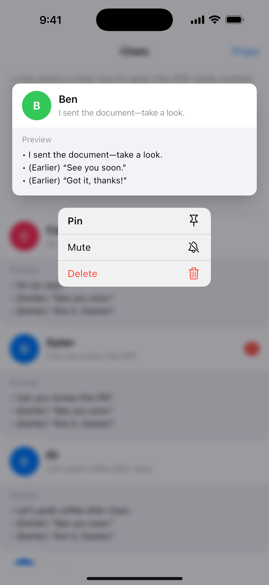

# cupertino_context_menu_demo

Demo app for `CupertinoContextMenu` (iOS-style “long-press” context menu).

## What this demo shows (real use-case)
This tiny app is a “Chats” list. Long-press a chat to open a context menu with quick actions like Pin, Mute, and Delete (similar to iOS Messages).

Tap **Props** (top-right) to live-toggle the 3 attributes shown in the presentation.

## The 3 attributes (and what changes on-screen)
1) `CupertinoContextMenu.builder`  
   - Default behavior: use the plain `child` as the preview.
   - Demo change: a custom preview card (rounded corners + shadow + extra “Preview” content).
   - Why change it: to show a richer preview that matches your app (e.g., message snippet, photo, document).

2) `CupertinoContextMenuAction.trailingIcon`  
   - Default: `null` (no icon).
   - Demo change: icons appear on the right side of each action row.
   - Why change it: to make actions easier to scan quickly (“Pin”, “Mute”, “Delete”).

3) `CupertinoContextMenuAction.isDestructiveAction`  
   - Default: `false`.
   - Demo change: the Delete action becomes visually destructive (red styling).
   - Why change it: to warn users before they tap an irreversible action.

## Run instructions
Prereq: Flutter installed.

1) Get packages: `flutter pub get`  
2) Run: `flutter run`

## Screenshot

## Presentation date
In-class presentation date: March 4, 2026 (Wednesday)
